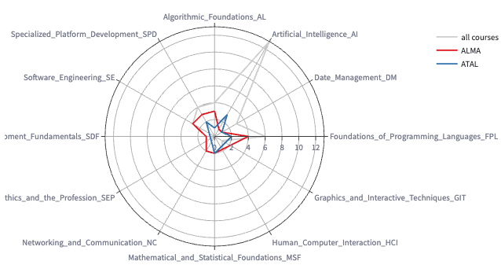

# Input

* `./data/BodyOfKnowledge` (BOK) is the extraction of Knowledge Units (KU) from [https://csed.acm.org/], aggregated per Knowledge AREA (KA). Knowledge Unit as TXT file in Knowledge Are directories.

* `./data/courses.ttl` is a knowledge graph representation of the our Curricula in Nantes (may not a public document)

The objective is to align the UE of the Nantes curricula (NC) to the KU of BOK to see:
* is all KU covered by our UEs ?
* Does some UEs not aligned to any KU ?
* estimation of Hours/ECTS dedicated to KU/KA 

SPARQLLM is used to implement a pipeline that:
- enumerate UEs from NC
- Find 3 KU candidates with Vector Search
- Ask LLM to confirm if really the UE is aligned to KU and why. 

The ouput is a alignement of UE to KU. As UEs have Ects, it should be possible to output a Radar view of NC.



# Index the Body Of Knowledge 

Install SPARQLLM Globally 

```
pip install git+https://github.com/momo54/SPARQLLM.git
```
You can update SPARQLLM with `pip install --upgrade git+https://github.com/momo54/SPARQLLM.git`.
Sometimes, i need "pip install --no-cache-dir --force-reinstall git+https://github.com/momo54/SPARQLLM.git"

install with virtualenv (recommended):
```
virtualenv xp-env
source xp-venv/bin/activate
pip install -r requirements.txt
```

Need Ollama installed, For Linux, MacOS:
```
curl -fsSL https://ollama.com/install.sh | sh
ollama serve &
ollama pull llama3.1:latest
ollama pull nomic-embed-text
```


Index the Body of Knowledge:
```
slm-index-faiss --txt-folder ./data/BodyOfKnowledge --faiss-dir ./XP/bok_store --recurse 
```

# run the query to align our cursus to BOK

Check config.bok to adjust parameter. Run the query (quite long):
```
slm-run --load data/courses.ttl --config config.bok --format=turtle -f queries/bok-graph.sparql --debug -o ./XP/bok.result --keep-store ./XP/bok.nq 
```

The same query with Constuct instead of select:
```
slm-run --load data/courses.ttl --config config.bok --format=turtle -f queries/bok-graph-construct.sparql --debug -o ./XP/bokc.ttl --keep-store ./XP/bokc.nq
```

Notes: 
Faiss relies on  FlatIP to index with  normalisation. Score close to 1 is good, 0 or minus -> not similar

# run the UI to explore the results

Need improv...

```
streamlit run scripts/streamlit-ui.py
```

# Some notes
- File name of BOK with ' ' and ',' !! -> `scripts/sanitize.py`
- grr, pendant la sauvegarde nq, j'ai une `Exception: "http://schema.org/Métaheuristiques multiobjectif" does not look like a valid URI, I cannot serialize this as N3/Turtle. Perhaps you wanted to urlencode it?` mais visiblement, le .nq est quand même propduit...
